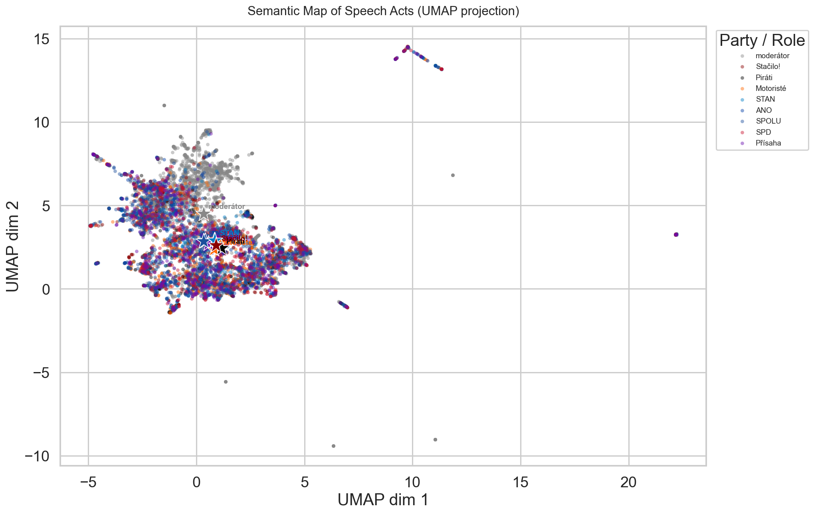
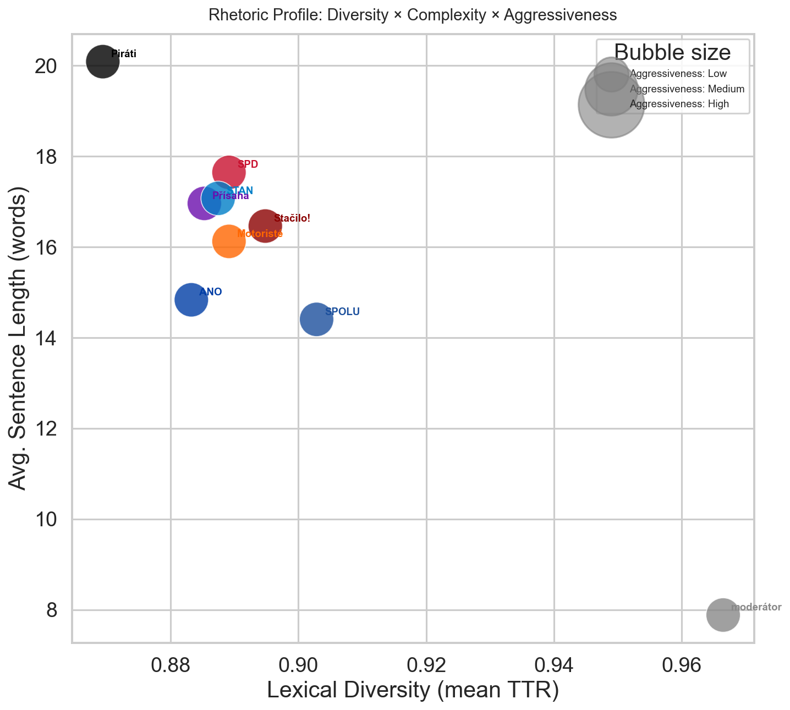
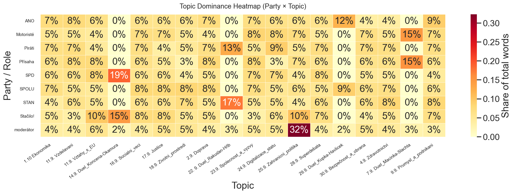

# Mapping Semantic Convergence and Lexical Diversity in the 2025 Czech Election Debates

> **Status:** Manuscript in preparation — findings are preliminary and subject to revision.

Computational analysis of Czech Television pre-election debate transcripts (autumn 2025) using
sentence embeddings, dimensionality reduction, and LLM-powered rhetorical tagging.

> **Working paper:** See [`working-paper.pdf`](working-paper.pdf) for the current write-up (in Czech).
> This is an informal prototype document, not a published or peer-reviewed article.

---

## O projektu (Czech)

Tato studie navrhuje a aplikuje kvantitativní pipeline pro analýzu politického diskurzu na korpusu
7 715 promluv z předvolebních debat České televize (podzim 2025). Metodologie propojuje sentence
embeddingy (model `paraphrase-multilingual-MiniLM-L12-v2`), redukci dimenzí algoritmem UMAP a
lexikální metriky (TTR, Maas index) s klasifikací promluv pomocí velkých jazykových modelů.
Výsledky naznačují výraznou sémantickou konvergenci středových stran, odlišnou syntaktickou
komplexitu Pirátů a specifické tematické strategie protisystémových subjektů. Výzkum dále
pokračuje ve spolupráci s kolegy z Katedry obecné lingvistiky FF UP.

---

## Key Findings

### 1. Semantic Map of Political Discourse



The UMAP projection of sentence embeddings reveals a dominant central cluster where the majority of
parliamentary parties converge, suggesting that — despite declared ideological differences — Czech
political parties operate within a shared semantic space during pre-election debates. This is
consistent with discourse mainstream theory (Angermuller 2014).

Separate peripheral clusters in the upper and right parts of the projection represent semantically
distinct speech types — likely procedural utterances, emotionally charged statements, or specific
duel formats. These outliers appear across all parties, indicating that semantic distinctiveness
is driven more by communicative genre than by party affiliation.

---

### 2. Rhetorical Profile: Lexical Diversity × Syntactic Complexity



| Party / Role | Avg. TTR | Maas *a²* | Avg. sentence length (words) |
|---|---|---|---|
| moderátor    | 0.967 | 0.005 |  7.9 |
| SPOLU        | 0.903 | 0.008 | 14.4 |
| Stačilo!     | 0.895 | 0.008 | 16.5 |
| SPD          | 0.889 | 0.009 | 17.6 |
| Motoristé    | 0.889 | 0.009 | 16.1 |
| STAN         | 0.887 | 0.008 | 17.1 |
| Přísaha      | 0.885 | 0.009 | 17.0 |
| ANO          | 0.883 | 0.010 | 14.8 |
| Piráti       | 0.869 | 0.008 | 20.1 |

Key observations:
- **Piráti** stand out as a syntactic-complexity outlier: the longest average sentences (20.1 words)
  combined with the lowest lexical diversity (TTR 0.869), suggesting expert-style, technically
  structured argumentation with repeated key terms.
- **SPOLU** shows the opposite profile — short, lexically varied utterances (TTR 0.903, avg. 14.4
  words/sentence) — consistent with a message-discipline communication strategy.
- **SPD** combines high sentence length (~17.6) with mid-range TTR, indicating a rhetorically
  expanded style.
- The **moderator** sits in the extreme corner: very short sentences (7.9 words) with exceptionally
  high diversity (TTR 0.967), reflecting the functional role of asking brief, non-repetitive questions.

---

### 3. Thematic Dominance Heatmap



The heatmap of 18 thematic debate blocks reveals several strategic patterns:
- **ANO** shows stable coverage (6–8 %) across most topics, with notable drops in defence and
  healthcare (4 %).
- **SPOLU** achieves the most even distribution across all blocks (mostly 7–8 %), reflecting
  comprehensive government-agenda coverage without strong thematic peaks.
- **Piráti** concentrate disproportionately on *Digitization of the State* (9 %), likely tied to
  the agenda of ex-minister Bartoš.
- **SPD** shows an extreme spike in the 14 September duel format (19 % of total word volume),
  dwarfing all other blocks.
- **Stačilo!** concentrates heavily on *EU Relations* and *Foreign Policy* (10 % each) while
  almost ignoring defence (4 %), education (3 %), and social challenges (3 %).

---

## Ongoing Work & Team

This repository is an active research project continuing beyond its seminar origins. The work is
being developed further in collaboration with:

- **doc. Mgr. Dan Faltýnek, Ph.D.** — Department of General Linguistics, Faculty of Arts, Palacký University Olomouc
- **Mgr. Martina Benešová, Ph.D.** — Department of General Linguistics, Faculty of Arts, Palacký University Olomouc

Planned extensions include a temporal analysis of semantic drift across the debate series,
interaction analysis (who responds to whom), and cross-language comparison with debate corpora
from other Central European countries.

---

## What it does

The pipeline processes a raw debate transcript and produces three publication-quality figures:

| Figure | Description |
|---|---|
| `semantic_map.png` | UMAP scatter of every speech act, coloured by party, with centroid stars |
| `entropy_complexity.png` | Bubble chart — Lexical Diversity × Avg. Sentence Length × Aggressiveness |
| `topic_heatmap.png` | Party × Topic word-count dominance heatmap |

---

## Quick start

### 1. Install dependencies

```bash
pip install -r requirements.txt
```

> `umap-learn` and `anthropic` are optional.
> If `umap-learn` is absent, PCA is used automatically.
> If `anthropic` is absent, the `--enrich` flag cannot be used.

### 2. Place the transcript

Put your UTF-8 encoded `*.txt` debate transcript in `data/raw/`.
Each line must follow the format:

```
Speaker Name (Party) [HH:MM:SS](Topic): Speech text …
```

### 3. Run the pipeline

```bash
# Full pipeline — no LLM call
python main.py

# Include LLM enrichment (sentiment / aggressiveness / framing)
export ANTHROPIC_API_KEY="sk-ant-..."
python main.py --enrich

# Force re-run all stages (ignore cached outputs)
python main.py --force
```

Results are written to `results/`.

---

## Project layout

```
FinalTask/
├── main.py                        # Orchestration entry point
├── requirements.txt
├── article.tex                    # LaTeX source of the working paper
├── working-paper.pdf              # Current working paper (PDF, in Czech)
├── TECHNICKA_DOKUMENTACE.md       # Czech technical documentation
├── src/
│   ├── config.py                  # All paths, palette, seaborn style
│   ├── parser.py                  # Transcript → cleaned_debates.csv
│   ├── analytics.py               # TTR/Maas, embeddings, UMAP/PCA, centroids
│   ├── enrichment.py              # Anthropic API batch tagging
│   └── visualization.py           # Three figures
├── data/
│   ├── raw/                       # Source transcripts (*.txt)
│   ├── interim/                   # Intermediate artefacts (auto-generated)
│   └── processed/                 # Enriched CSV (auto-generated)
├── models/                        # Sentence-transformer weights (auto-downloaded)
└── results/                       # Output figures (auto-generated)
```

---

## Pipeline stages

| Stage | Module | Output |
|---|---|---|
| 1. Parse | `parser.py` | `data/interim/cleaned_debates.csv` |
| 2. Lexical metrics | `analytics.py` | `data/interim/lexical_metrics.csv` |
| 3. Embeddings | `analytics.py` | `data/interim/embeddings.npy` |
| 4. Dim. reduction | `analytics.py` | `data/interim/umap_coords.csv` |
| 5. LLM enrichment | `enrichment.py` | `data/processed/final_enriched_data.csv` |
| 6. Visualisation | `visualization.py` | `results/*.png` |

Every expensive stage is **idempotent**: if the output file already exists with the
correct number of rows, the stage is skipped automatically.

---

## Dataset

- **Source:** Czech Television pre-election debate transcripts (`data/raw/full_transcript.txt`)
- **Period:** September–October 2025
- **Scope:** 18 thematic debate blocks
- **Size:** 7,715 speech acts, 115 unique speakers
- **Parties:** ANO · SPOLU · Piráti · STAN · SPD · Stačilo! · Motoristé · Přísaha · moderátor

---

## Embedding model

[`paraphrase-multilingual-MiniLM-L12-v2`](https://www.sbert.net/docs/pretrained_models.html)
(sentence-transformers) — 12-layer multilingual MiniLM, 384-dimensional output,
supports Czech out of the box.

---

## Environment variables

| Variable | Required | Description |
|---|---|---|
| `ANTHROPIC_API_KEY` | Only for `--enrich` | Anthropic API key |

---

## Technical documentation

See [TECHNICKA_DOKUMENTACE.md](TECHNICKA_DOKUMENTACE.md) for a detailed module-by-module
description in Czech.

---

## Acknowledgements

This project originated as a seminar paper for the course **KRAD — Kritická analýza diskurzu**
at the Department of General Linguistics, Palacký University Olomouc, and is continuing as an
independent research initiative.
